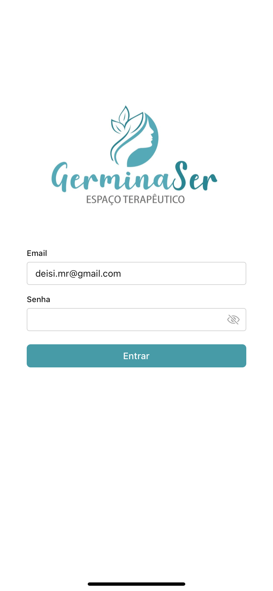

# GerminaSer APP

Aplicativo de reserva de salas feito para a clínica GerminaSer. O app permite que os usuários façam reservas, gerenciem seus agendamentos e visualizem de forma mais eficiente os horários disponíveis de cada sala das clínicas.

A API foi construida em Ruby on Rails (https://github.com/PedroPortow/germinaser-backend)

## Tecnologias Utilizadas

- **React Native (Expo)**

## Bibliotecas Utilizadas

- **NativeBase**
- **React Native Calendars**
- **React Navigation**

## Imagens do Aplicativo

<ul>
   <li style="margin-bottom: 60px;">
    
<strong>Login</strong>

    
  </li>
   <li style="margin-bottom: 60px;">
    
<strong>Home</strong>

    
  </li>
   <li style="margin-bottom: 60px;">
    
<strong>Visualização Horários Disponíveis</strong>

    
  </li>
   <li style="margin-bottom: 60px;">
    
<strong>Gerenciamento de Agendamentos</strong>

    
  </li>
   <li style="margin-bottom: 60px;">
    
<strong>Horários Disponíveis para criação da reserva</strong>

    
  </li>
</ul>
